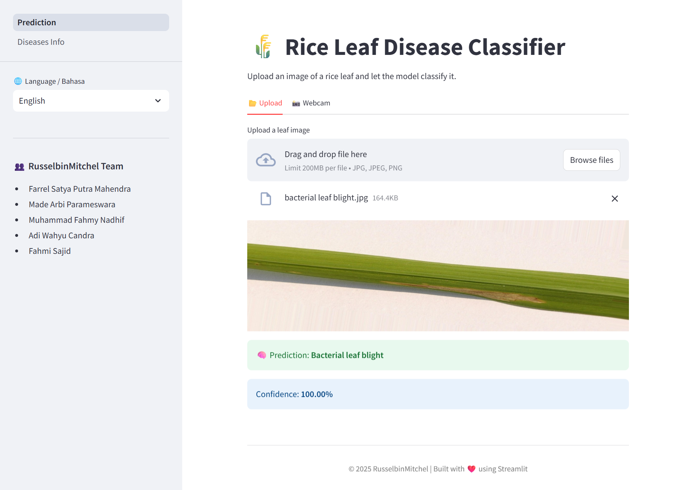
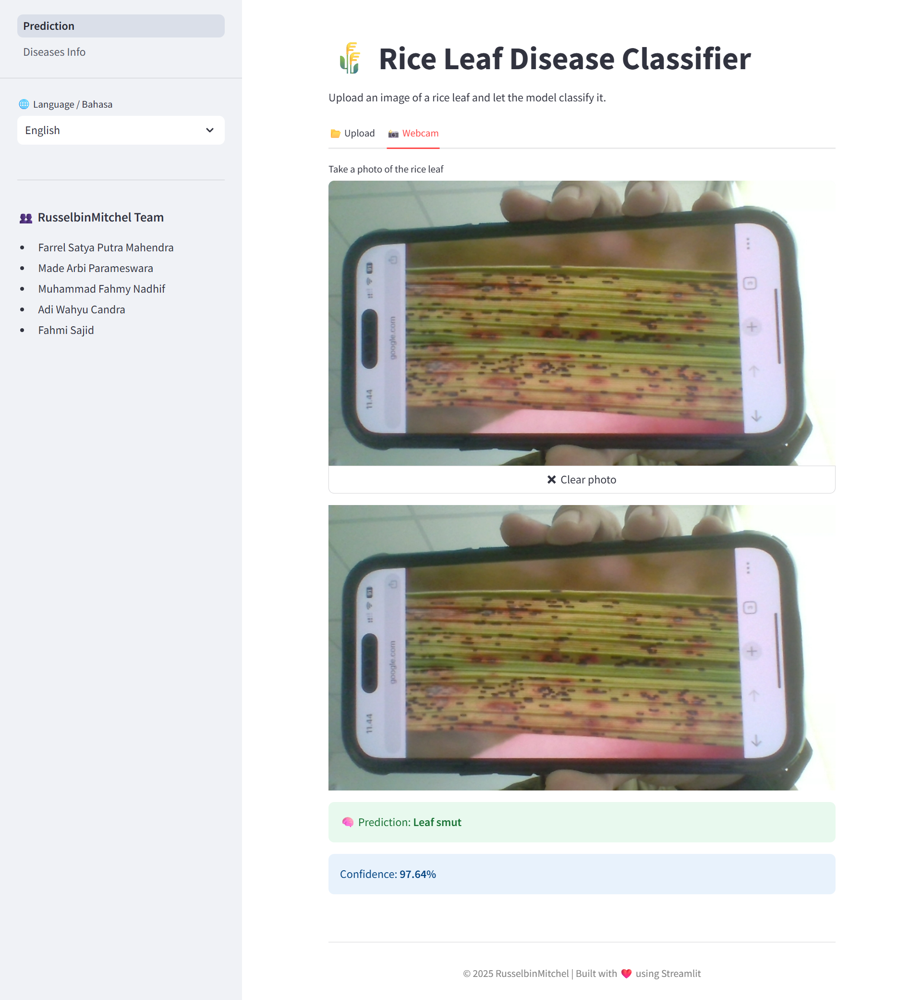
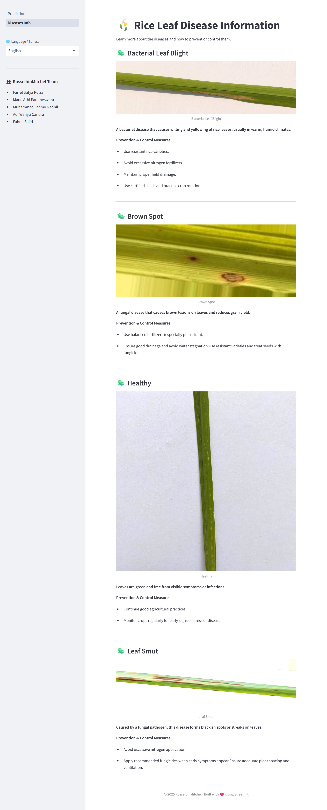

# 🌾 Rice Disease Classifier Web App

A deep learning-powered web application that detects rice leaf diseases from images. Built with **PyTorch**, **Streamlit**, **Docker**, and deployed to **AWS ECS** with **CI/CD** via GitHub Actions. 

## 🧠 Model Performance

This app uses a fine-tuned **ResNet18** convolutional neural network trained on two rice leaf disease datasets. The model achieved:

> ✅ **100% Validation Accuracy**

## 🚀 Features

- 🧠 Deep learning model trained on 4 classes: Healthy, Brown Spot, Leaf Smut, Bacterial Leaf Blight
- 📷 Image input via **upload** or **webcam**
- 🌍 Multilingual support: **English & Bahasa Indonesia**
- 📚 Educational page: explanation and prevention tips for each disease
- 📈 Real-time inference with confidence score
- 🔁 Automatic deployment via GitHub Actions + Docker + AWS ECS

## 🖼️ Screenshots

### 🏠 Home Page


### 📸 Inference with Webcam


### 📚 Disease Information


## 🏗️ Setup & Run Locally

### 1. Clone the repo

```bash
git clone https://github.com/your-username/rice-disease.git
cd rice-disease
```

### 2. Install dependencies

```bash
pip install -r requirements.txt
```

### 3. Run the app

```bash
streamlit run Prediction.py
```

## 🐳 Docker Support
### Build the image
```bash
docker build -t rice-disease-app .
```

### Run the container
```bash
docker run -p 8501:8501 rice-disease-app
```
## 🔄 CI/CD Pipeline
On every git push to main, GitHub Actions:
- Builds the Docker image
- Pushes to Docker Hub
- Deploys to AWS ECS (Fargate)

## ☁️ Deployment
The app is deployed on AWS ECS (Fargate). Access it from the public IP or domain provided by your ECS service.

## 👨‍👩‍👧‍👦 Team
- Farrel Satya Putra Mahendra
- Made Arbi Parameswara
- Muhammad Fahmy Nadhif
- Adi Wahyu Candra Kusuma
- Fahmi Sajid
